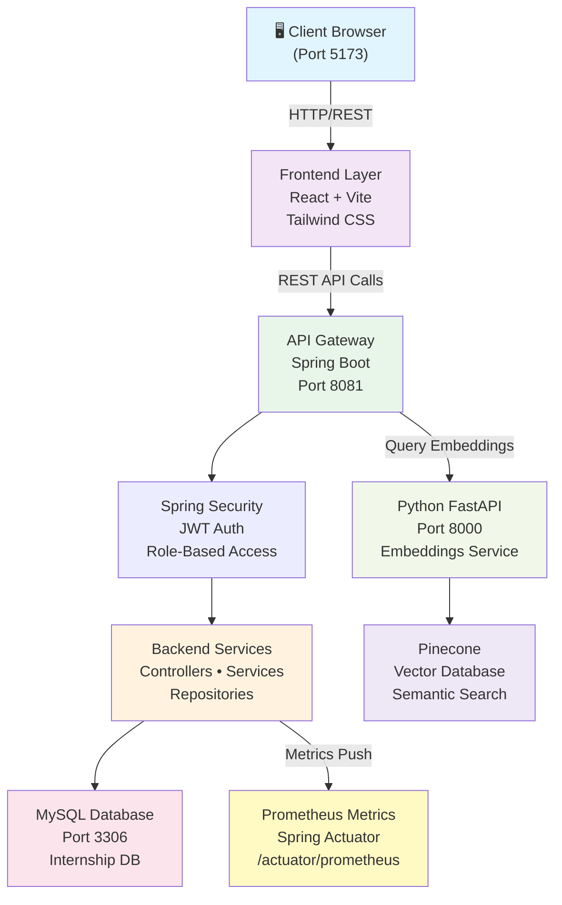
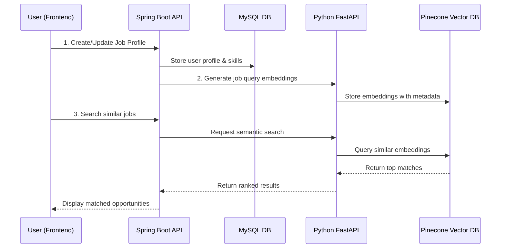
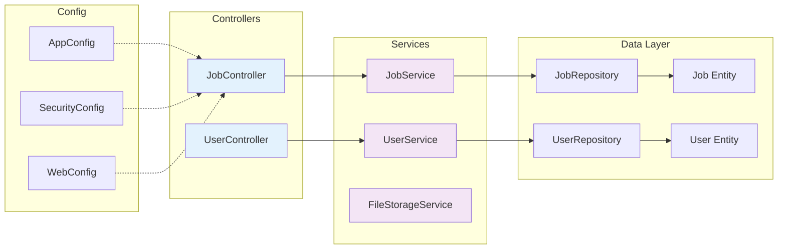
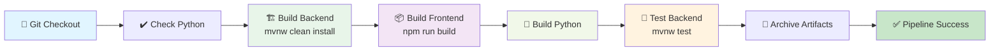

# 🚀 Job Matching Platform

> A modern, full-stack AI-powered job matching platform designed to connect talent with opportunities through intelligent semantic search and real-time profile matching.

[](https://spring.io/projects/spring-boot)
[](https://react.dev)
[](https://vitejs.dev)
[](https://www.mysql.com)
[](https://www.oracle.com/java/)

---

## 📋 Table of Contents

- [Overview](#overview)
- [Key Features](#-key-features)
- [Technology Stack](#-technology-stack)
- [System Architecture](#-system-architecture)
- [Project Structure](#-project-structure)
- [Quick Start](#-quick-start)
- [Development Setup](#-development-setup)
- [CI/CD Pipeline](#-cicd-pipeline)
- [Deployment](#-deployment)
- [Contributing](#-contributing)

---

## Overview

The **Job Matching Platform** is an intelligent recruitment solution that leverages:
- **Semantic AI Search** with vector embeddings for job-candidate matching
- **Real-time Profile Management** with role-based access control
- **RESTful Architecture** for scalable microservice deployment
- **Modern UI/UX** with responsive React components and Tailwind CSS

This internship project demonstrates a production-ready full-stack application with proper separation of concerns, security practices, and automated CI/CD.

---

## ✨ Key Features

| Feature | Description | Technology |
|---------|-------------|-----------|
| 🔍 **Semantic Job Search** | AI-powered similarity matching between candidates and jobs | Python FastAPI + Pinecone + Sentence Transformers |
| 👤 **Profile Management** | User profiles with skills, experience, and job preferences | Spring Boot REST API + JPA/Hibernate |
| 🛡️ **Secure Authentication** | JWT-based session management with role-based access | Spring Security + SecurityConfig |
| 📊 **Dashboard Analytics** | Real-time metrics and matching statistics | Prometheus + Spring Actuator |
| 🎨 **Modern UI** | Responsive component library with dark/light mode support | React 18 + Radix-UI + Tailwind CSS |
| ⚡ **Real-time Updates** | Hot module replacement during development | Vite HMR |
| 🔄 **Automated CI/CD** | Full build pipeline from git commit to deployment | Jenkins orchestration |

---

## 🛠️ Technology Stack

### Backend Services
```
┌─────────────────────────────────────────────┐
│  Spring Boot 4.0.3 API Server (Port 8081)   │
├─────────────────────────────────────────────┤
│  • Java 21 Runtime                          │
│  • Spring Data JPA + Hibernate ORM          │
│  • Spring Security + JWT Authentication     │
│  • Spring Actuator + Prometheus Metrics     │
│  • Maven Build System                       │
└─────────────────────────────────────────────┘
         ↕ (REST API)
┌─────────────────────────────────────────────┐
│  MySQL 5.7+ Database (Port 3306)            │
│  Database: "Internship"                     │
└─────────────────────────────────────────────┘
```

### Frontend Application
```
┌─────────────────────────────────────────────┐
│  React 18.2 + Vite 5.0 (Port 5173)          │
├─────────────────────────────────────────────┤
│  • TypeScript (optional)                    │
│  • Tailwind CSS + PostCSS                   │
│  • Radix-UI Component Library               │
│  • React Router v7 (SPA Routing)            │
│  • Framer Motion (Animations)               │
│  • Lucide Icons                             │
│  • npm Package Manager                      │
└─────────────────────────────────────────────┘
```

### AI/Vector Service
```
┌─────────────────────────────────────────────┐
│  Python FastAPI (Port 8000)                 │
├─────────────────────────────────────────────┤
│  • Sentence Transformers (Embeddings)       │
│  • Pinecone Vector Database                 │
│  • Pydantic (Data Validation)               │
│  • Async Request Handling                   │
└─────────────────────────────────────────────┘
```

---

## 🏗️ System Architecture

### High-Level Architecture Diagram



### Data Flow: Job Matching Process



### Component Architecture (Backend Services)



---

## 📁 Project Structure

```
internship/
│
├── 📘 backend/                           # Spring Boot REST API
│   └── demo/
│       ├── src/main/java/com/app/demo/
│       │   ├── 🎮 Controller/            # REST endpoints (JobController, UserController)
│       │   ├── 🔧 Service/               # Business logic (JobService, UserService, FileStorageService)
│       │   ├── 🗂️ Entity/                # JPA entities (Job, User, etc.)
│       │   ├── 📦 DTO/                   # Data transfer objects
│       │   ├── 🔍 Repository/            # Data access (JPA Repositories)
│       │   ├── ⚙️ Config/               # Spring configs (Security, Web, App)
│       │   └── 🚀 DemoApplication.java  # Main entry point
│       ├── src/test/                    # Unit & integration tests
│       ├── src/main/resources/
│       │   ├── 🔐 application.properties # DB, JPA, Actuator config
│       │   ├── 📁 static/               # Static assets
│       │   └── 🎨 templates/            # Email/view templates
│       ├── target/                      # Build artifacts
│       ├── 📜 pom.xml                   # Maven dependencies
│       ├── 📝 mvnw / mvnw.cmd           # Maven wrapper scripts
│       └── 📁 uploads/                  # File storage directory
│
├── 🎨 frontend/                         # React + Vite application
│   ├── src/
│   │   ├── 📄 App.jsx                   # Root component
│   │   ├── 📄 main.jsx                  # Entry point
│   │   ├── 🎭 components/
│   │   │   ├── dashboard/               # Profile, matching dashboard, wizards
│   │   │   ├── home/                    # Landing, gallery, marquee
│   │   │   ├── layout/                  # Header, footer, auth components
│   │   │   └── ui/                      # Radix-UI primitives (button, card, input, label)
│   │   ├── 🔐 context/                  # AuthContext for state management
│   │   ├── 🛠️ lib/                      # Utility functions
│   │   └── 🎨 styles/                   # Global CSS / Tailwind imports
│   ├── 📜 package.json                  # npm dependencies
│   ├── ⚡ vite.config.js                # Vite config (@ alias to src/)
│   ├── 🎯 tailwind.config.js            # Tailwind CSS theme
│   ├── 🔌 postcss.config.js             # PostCSS plugins
│   ├── dist/                            # Production build output
│   └── node_modules/                    # Dependencies
│
├── 🐍 resume/                           # Python FastAPI service
│   ├── 📄 main.py                       # FastAPI app + endpoints
│   ├── 📁 extracted_texts/              # Resume parsing output
│   ├── 🔐 .env                          # Pinecone API keys (not committed)
│   └── 📜 requirements.txt               # Python dependencies
│
├── 🔄 Jenkinsfile                       # CI/CD pipeline definition
├── 📝 README.md                         # This file
├── 🐹 h.go                              # Go learning/reference file
└── 🔗 copilot-instructions.md           # AI agent development guidelines
```

---

## ⚡ Quick Start

### Prerequisites

- **Java 21** or higher
- **Node.js 18+** & npm 9+
- **Python 3.10+** & pip
- **MySQL 5.7+** (running on `localhost:3306`)
- **Git**

### 1️⃣ Clone Repository

```bash
git clone https://github.com/shxrky17/Internship.git
cd Internship
```

### 2️⃣ Configure Database

Create MySQL database (if not exists):
```sql
CREATE DATABASE Internship CHARACTER SET utf8mb4 COLLATE utf8mb4_unicode_ci;
CREATE USER 'root'@'localhost' IDENTIFIED BY 'root';
GRANT ALL PRIVILEGES ON Internship.* TO 'root'@'localhost';
FLUSH PRIVILEGES;
```

---

## 🖥️ Development Setup

### Terminal 1: Start Backend (Spring Boot)

```bash
cd backend/demo

# First build - downloads all Maven dependencies
mvnw.cmd clean install -DskipTests

# Start development server (port 8081)
mvnw.cmd spring-boot:run
```

**Verify Backend**:
```bash
# Health check
curl http://localhost:8081/actuator/health

# Metrics endpoint (Prometheus format)
curl http://localhost:8081/actuator/prometheus
```

### Terminal 2: Start Frontend (React + Vite)

```bash
cd frontend

# Install dependencies
npm install

# Start dev server (port 5173, with hot reload)
npm run dev

# Open browser at http://localhost:5173
```

### Terminal 3: Start Python AI Service (FastAPI)

```bash
cd resume

# Install Python dependencies
pip install -r requirements.txt
# OR manually: pip install fastapi pydantic sentence-transformers pinecone-client python-dotenv

# Create .env file with Pinecone API key
echo PINECONE_API_KEY=your_key_here > .env

# Start FastAPI server (port 8000)
uvicorn main:app --reload
```

### ✅ All Services Running

```
Frontend   → http://localhost:5173    (React Vite Dev Server)
Backend    → http://localhost:8081    (Spring Boot API)
Python AI  → http://localhost:8000    (FastAPI)
Database   → localhost:3306           (MySQL)
```

---

## 🧪 Running Tests

### Backend Tests
```bash
cd backend/demo
mvnw.cmd test                          # Run all unit tests
mvnw.cmd test -Dtest=DemoApplicationTests  # Run specific test
```

### Frontend Tests
```bash
cd frontend
npm test                               # Run Jest tests (if configured)
npm run lint                           # Check code quality
```

---

## 🚀 Production Build

### Build All Components

```bash
# Backend WAR/JAR
cd backend/demo
mvnw.cmd clean package                 # Creates target/*.jar

# Frontend Static Assets
cd frontend
npm run build                          # Creates dist/ directory

# Python Service
cd resume
pip install -r requirements.txt
# Deploy uvicorn with gunicorn/supervisor
```

---

## 🔄 CI/CD Pipeline

### Jenkins Pipeline Stages



### Setup Jenkins

#### 1. Install Required Plugins
Go to **Manage Jenkins** → **Manage Plugins** → **Available**:
- ✅ Pipeline
- ✅ Maven Integration
- ✅ NodeJS Plugin
- ✅ Git

#### 2. Configure Global Tools
Go to **Manage Jenkins** → **Global Tool Configuration**:

**Maven**:
```
Name: Maven 3.8.6
Install automatically: ✓
Version: 3.8.6
```

**NodeJS**:
```
Name: node 18
Install automatically: ✓
Version: 18.x (LTS)
```

**Java**:
```
Name: JDK 21
Install automatically: ✓
Version: 21
```

#### 3. Create Pipeline Job
1. Click **New Item**
2. Enter job name: `Internship-Build`
3. Select **Pipeline**
4. In **Pipeline** section:
   - Select: **Pipeline script from SCM**
   - SCM: **Git**
   - Repository URL: `https://github.com/shxrky17/Internship.git`
   - Credentials: Select or create
   - Script Path: `Jenkinsfile`
5. Click **Save**

#### 4. Run Pipeline
Click **Build Now** to trigger the full CI/CD pipeline.

**Pipeline Output**:
```
✓ Checkout source code from Git
✓ Verify Python installation
✓ Build Spring Boot Backend
✓ Build React Frontend
✓ Compile Python service
✓ Execute Backend Tests
✓ Archive build artifacts (JAR + dist/)
```

---

## 🌐 Deployment

### Option 1: Traditional Server Deployment

```bash
# Copy backend JAR
scp backend/demo/target/demo-*.jar user@server:/opt/app/

# Copy frontend dist
scp -r frontend/dist/* user@server:/var/www/html/

# Start backend on server
java -jar demo-*.jar --server.port=8081

# Serve frontend via Nginx
# Configure Nginx to proxy /api to backend:8081
```

### Option 2: Docker Containerization

**Dockerfile (Backend)**:
```dockerfile
FROM openjdk:21-slim
COPY backend/demo/target/*.jar app.jar
ENTRYPOINT ["java", "-jar", "app.jar"]
```

**Dockerfile (Frontend)**:
```dockerfile
FROM node:18-alpine as build
WORKDIR /app
COPY frontend .
RUN npm install && npm run build

FROM nginx:alpine
COPY --from=build /app/dist /usr/share/nginx/html
```

---

## 🤝 Contributing

### Development Workflow

1. **Create a feature branch**:
   ```bash
   git checkout -b feature/your-feature-name
   ```

2. **Make your changes** following [copilot-instructions.md](copilot-instructions.md)

3. **Test locally**:
   ```bash
   cd backend/demo && mvnw.cmd test
   cd frontend && npm test
   ```

4. **Commit with clear messages**:
   ```bash
   git commit -m "feat: add job matching algorithm"
   ```

5. **Push and create Pull Request**:
   ```bash
   git push origin feature/your-feature-name
   ```

### Code Standards

- **Java**: Follow Spring Boot conventions (see `copilot-instructions.md`)
- **React**: Functional components + hooks, Tailwind CSS only (no inline styles)
- **Python**: PEP 8 style guide
- **SQL**: Use JPA/Hibernate ORM (avoid raw SQL)

---

## 📊 Project Statistics

| Metric | Value |
|--------|-------|
| **Total Files** | 60+ |
| **Backend LOC** | ~2,000+ (Java) |
| **Frontend LOC** | ~3,000+ (JSX) |
| **Python LOC** | ~500+ |
| **Test Coverage** | Expanding |
| **Dependencies** | 50+ (Maven) + 40+ (npm) + 8+ (pip) |

---

## 📚 Additional Resources

- 📖 [Spring Boot Documentation](https://spring.io/projects/spring-boot)
- ⚛️ [React Documentation](https://react.dev)
- 🚀 [Vite Guide](https://vitejs.dev/guide/)
- 🎯 [Radix-UI Components](https://www.radix-ui.com/docs/primitives/overview/introduction)
- 🎨 [Tailwind CSS](https://tailwindcss.com/docs)
- 🐍 [FastAPI Tutorial](https://fastapi.tiangolo.com/tutorial/)
- 📌 [Pinecone Vector Database](https://www.pinecone.io/learn/)

---

## 📝 License

This project is part of an internship program. All rights reserved.

---

## 👥 Support

For questions or issues:
- 📧 **Email**: [Your Email]
- 💬 **Discord/Slack**: [Link]
- 📍 **GitHub Issues**: [GitHub Issues Link](https://github.com/shxrky17/Internship/issues)

---

**Last Updated**: April 2026  
**Repository**: [shxrky17/Internship](https://github.com/shxrky17/Internship)  
**Status**: 🟢 Active Development
