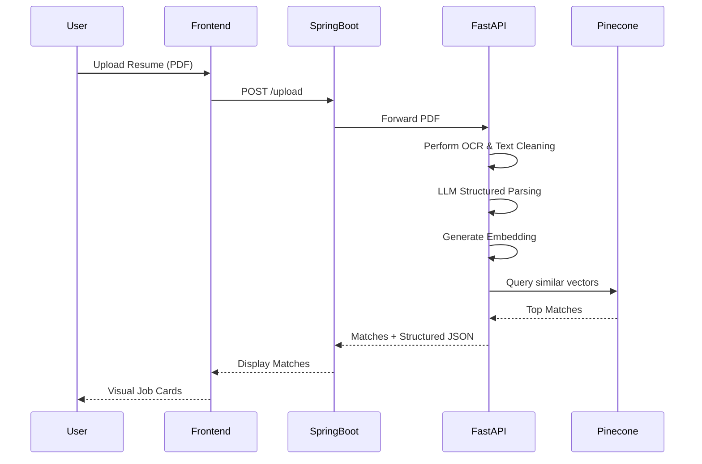
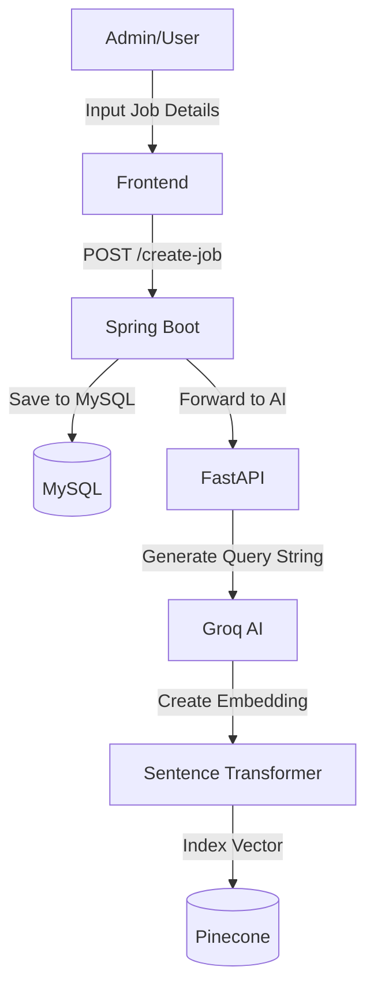

# Internship AI Platform: Technical Documentation

## 1. Project Overview

The **Internship AI Platform** is a state-of-the-art solution designed to bridge the gap between job seekers and employers using Artificial Intelligence. It features an automated resume analyzer, semantic job matching, and a modern interactive dashboard.

### Key Features
- **Intelligent Resume Parsing**: Extracts structured data from PDF resumes using OCR and LLMs.
- **AI-Powered Job Matching**: Uses vector embeddings and Pinecone to match candidates with the most relevant jobs.
- **Full-Stack Integration**: A robust Spring Boot backend coupled with a high-performance FastAPI AI service.
- **Premium User Experience**: Built with React, Tailwind CSS, and shadcn/ui for a seamless and responsive UI.

### Tech Stack
- **Frontend**: React.js, Tailwind CSS, Lucide Icons, shadcn/ui.
- **Backend**: Java Spring Boot, Spring Security, MySQL.
- **AI Service**: Python FastAPI, Groq AI (Llama 3/Gemma), Tesseract OCR.
- **Vector Database**: Pinecone (for semantic search).
- **Communication**: RESTful APIs, CORS-enabled.

---

## 2. System Architecture

The application follows a distributed architecture where the heavy lifting of AI processing is decoupled from the main business logic.

### Architectural Flow:
1.  **Frontend**: The React application collects user data and resume uploads.
2.  **Spring Boot Backend**: Manages user authentication, profile persistence, and job metadata in a MySQL database.
3.  **FastAPI AI Service**: Receives resumes, performs OCR, calls Groq AI for structured parsing, and interacts with Pinecone for vector indexing/search.
4.  **Database Layer**:
    - **MySQL**: Relational data (Users, Jobs).
    - **Pinecone**: Vector data (Embeddings of job descriptions and resumes).

---

## 3. Backend Documentation (Spring Boot)

### Core Controllers

#### [UserController](file:///e:/Internship/backend/demo/src/main/java/com/app/demo/Controller/UserController.java#25-131)
Manages the authentication lifecycle.
- `POST /register`: Registers a new user.
- `POST /login`: Authenticates user and initiates session.
- `POST /logout`: Terminates session.
- `POST /me`: Returns the currently authenticated user details.
- `GET /get-profile`: Retrieves the user's profile associated with their account.

#### [ProfileController](file:///e:/Internship/backend/demo/src/main/java/com/app/demo/Controller/ProfileController.java#19-79)
Handles user-specific data and file uploads.
- `POST /upload`: Forwards the uploaded resume to the FastAPI service.
- `POST /add-profile`: Saves personal details (phone, gender, state) to the database.

#### [JobController](file:///e:/Internship/backend/demo/src/main/java/com/app/demo/Controller/JobController.java#13-25)
Job management and AI integration.
- `POST /create-job`: Creates a job posting and triggers the generation of a semantic search query in Pinecone.

### Security Configuration
The backend uses **Spring Security** with a session-based approach. It is configured to allow credentials and handle CORS requests from the frontend origin.

---

## 4. AI & Vector Service (FastAPI)

The Python service is the "brain" of the application.

### Key Logic
- **OCR Engine**: Uses `pytesseract` to extract text from scanned PDFs.
- **Text Cleaning**: Sophisticated regex-based cleaning to remove noise from extracted text.
- **LLM Integration**: Uses **Groq Cloud API** to transform raw text into a structured JSON format (Personal Info, Skills, Education, Experience).
- **Semantic Search**:
    - **Embeddings**: Uses `SentenceTransformer` (`all-MiniLM-L6-v2`) to convert text into 384-dimensional vectors.
    - **Vector Search**: Queries **Pinecone** to find the top matching jobs based on cosine similarity of embeddings.

### Endpoints
- `POST /analyze-resume`: Extracts text and returns structured JSON.
- `POST /generate-query`: Indexes a new job in Pinecone.
- `POST /search-jobs-from-resume`: The end-to-end matching flow.

---

## 5. Frontend Documentation (React)

### Component Structure
- **Layout**: `Header`, `Footer`, and `Sidebar` for consistent navigation.
- **Landing**: `LandingView`, `GalleryCarousel`, and `Marquee` for a premium first impression.
- **Dashboard**:
    - `ProfileDashboard`: Main view for user stats.
    - `ProfileWizard`: A multi-step flow for profile completion.
    - `MatchDashboard`: Displays AI-matched job results.

### State Management
- **AuthContext**: A global React Context provider that manages user session, login/logout logic, and profile persistence.

---

## 6. Workflows

### Resume Matching Workflow

### Job Creation Workflow

